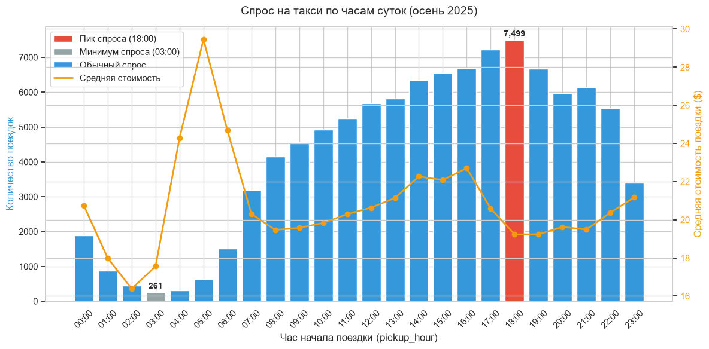
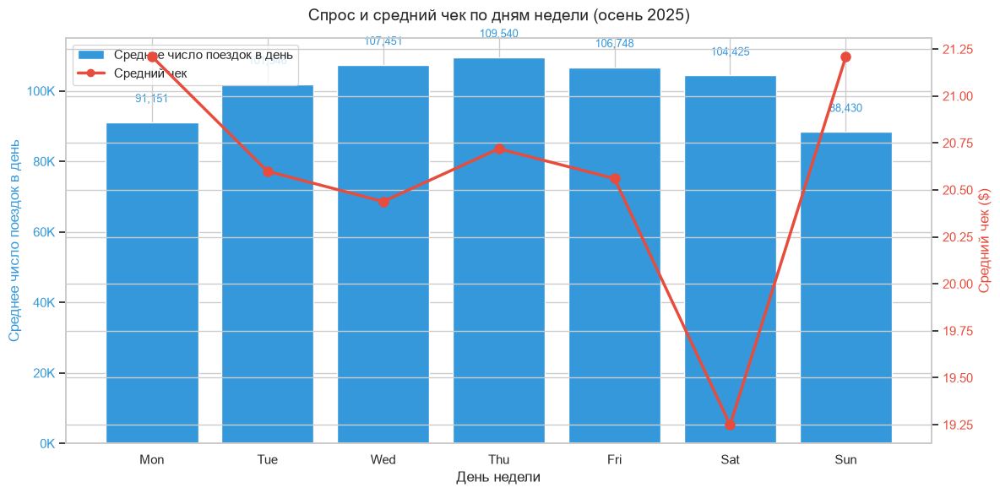
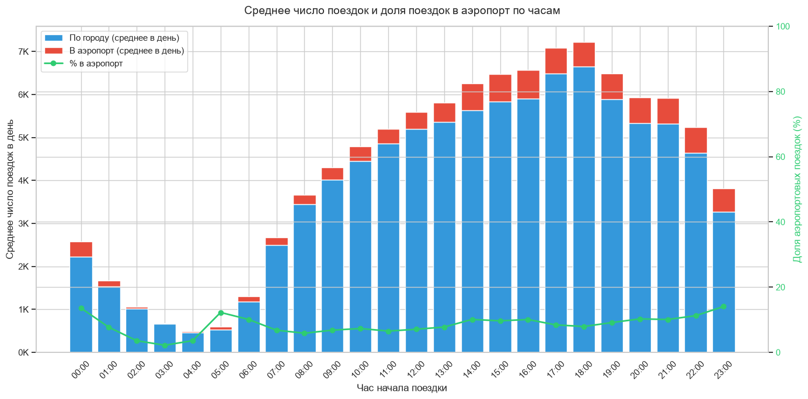
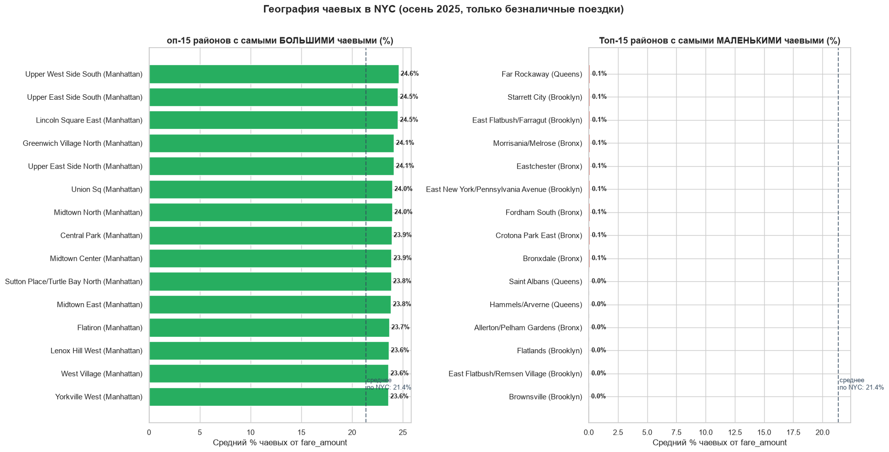
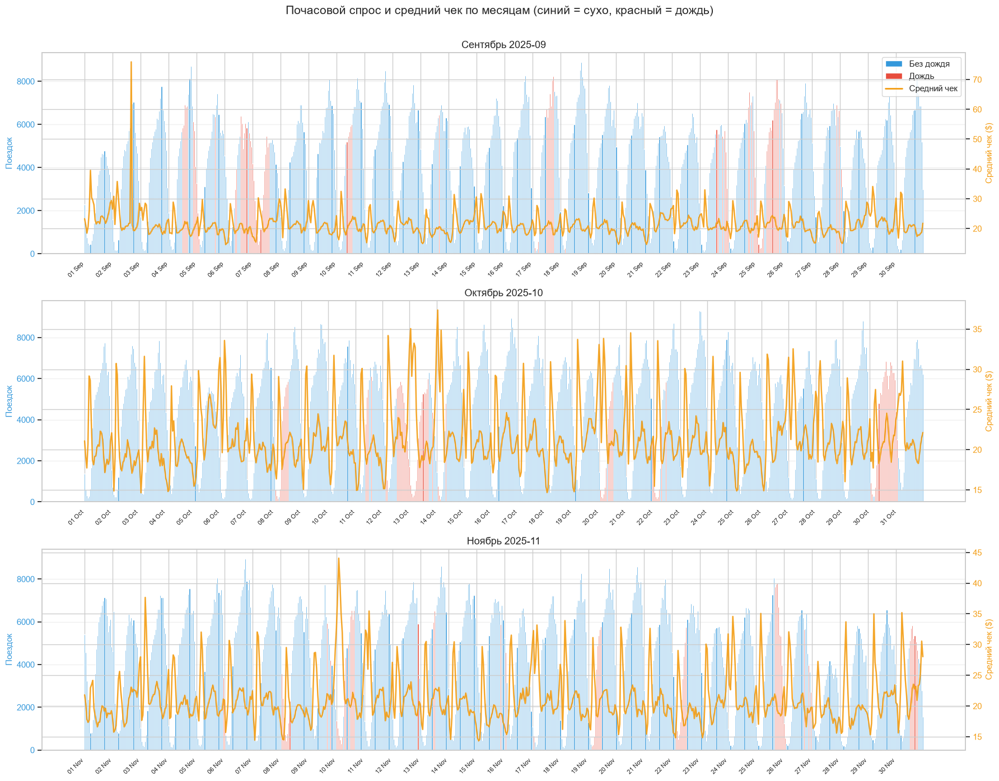
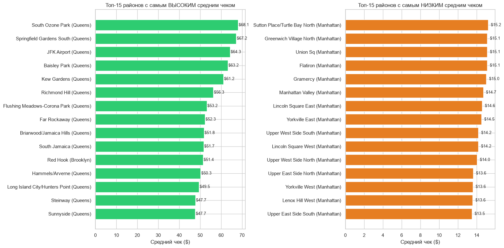

# Анализ поездок такси в Нью-Йорке (осень 2025)

## О проекте

ETL-пайплайн для анализа 12.8 млн поездок жёлтого такси в Нью-Йорке за сентябрь–ноябрь 2025. Данные загружаются напрямую из публичного репозитория NYC Taxi, очищаются и визуализируются.

**Объём данных:** 12,861,158 строк, 21 колонка. После очистки: 9,225,994 строк.

**Инструменты:** Python, Pandas, DuckDB, Plotly, Matplotlib/Seaborn, Requests.

## Структура проекта

- Загрузка данных через DuckDB и HTTPFS — паркеты читаются напрямую из облака без скачивания.
- Очистка данных: удаление выбросов (fare_amount <= 0, trip_distance <= 0, trip_duration_min вне [0, 300] и др.)
- Обогащение:

  - Длительность поездки (trip_duration_min)
  - Час/день недели/дата для аггрегаций
  - Погодные данные с Open-Meteo API (часовые осадки)
  - Зоны такси через внешний CSV
- Аггрегации и визуализации:

  - Спрос по часам суток
  - Спрос по дням недели
  - Поездки в аэропорт
  - Чаевые по районам (только безналичные поездки)
  - Влияние погоды на спрос и стоимость
  - Районы с высоким/низким средним чеком

## Основные выводы

### Спрос по часам

- **Пик спроса:** 18:00 — 7,499 поездок (медиана в день)
- **Минимум:** 03:00 — 261 поездка
- **Топ-3 часа**: 18:00, 17:00, 16:00
- *Средняя стоимость выше в ранние утренние часы (например, в 04:00 средний чек — $26.03).*

### Средний чек по дням недели

- **Пик:** пятница, затем четверг
- **Минимум:** воскресенье
- *Средний чек максимален в пятницу и субботу.*

### Поездки в аэропорт

- **Максимум поездок в аэропорт:** 16:00–21:00
- **Наибольшая доля:** 23:00–00:00 (~14%)
- *В среднем 8,990 аэропортовых поездок в день (8.9% от всех поездок).*

### Чаевые по районам

- **Щедрые районы:** Upper West Side, Upper East Side, Lincoln Square — >24% от стоимости.
- **Скупые:** районы Бруклина и Бронкса — 0–1%.
- **Средний процент чаевых по NYC:** 21.4% (только безналичные поездки).

### Влияние погоды

- **Дождливые часы:** на 0.1% больше поездок, средний чек выше на $0.48.
- *Эффект статистически слабый, но заметный.*

### Средний чек по районам

- **Самый высокий:** LaGuardia Airport ($65.6), затем JFK Airport ($59.5)
- **Самый низкий:** районы Бруклина и Бронкса (~$13–16)

## Этапы ETL

1. Extract

   - Загрузка 3 паркет-файлов (сентябрь–ноябрь 2025) через DuckDB + HTTPFS.
   - Загрузка погоды (Open-Meteo).
   - Загрузка справочника зон такси.
2. Transform

   - Удаление пропусков и выбросов.
   - Добавление вычисляемых полей: trip_duration_min, pickup_hour, is_raining.
   - Аггрегация по часам, дням недели, районам.
   - Фильтрация безналичных поездок для анализа чаевых.
3. Load

   - Сохранение очищенных данных в clean_taxi (DataFrame).
   - Создание визуализаций и аналитических таблиц.

## Результаты
Все визуализации встроены в ноутбук и позволяют:
- Оценить динамику спроса
- Сравнить средние чеки по районам
- Найти корреляции с погодой
- Выявить районы с высокими/низкими чаевыми
- Проанализировать поездки в аэропорт