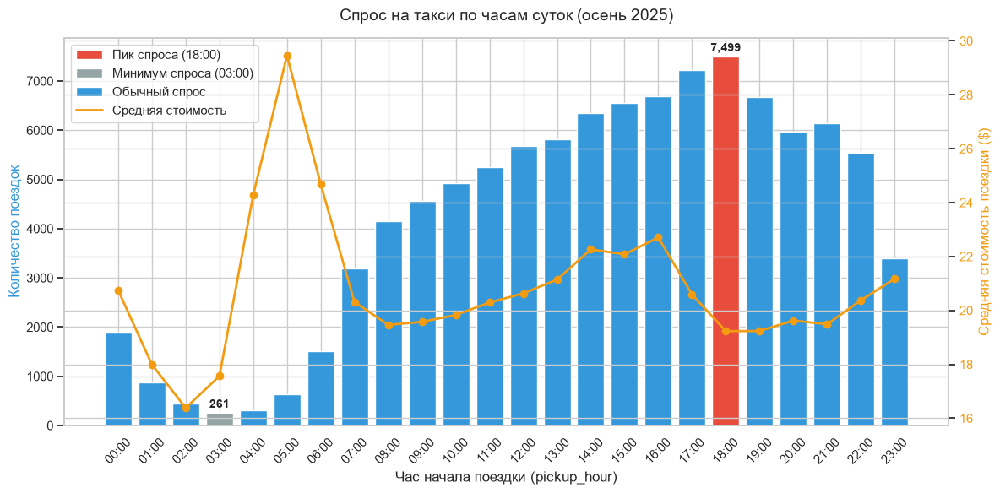
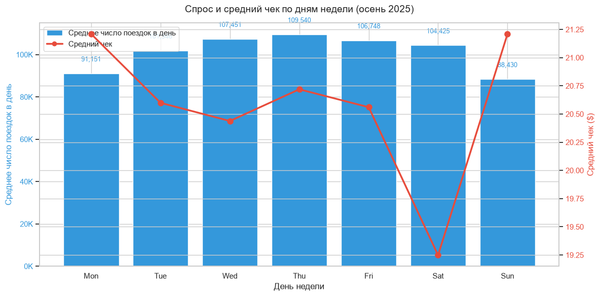
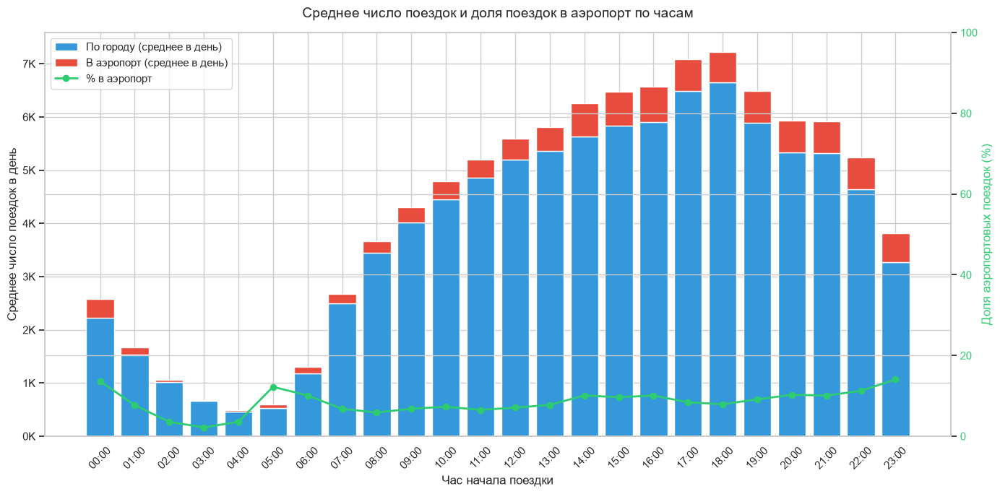
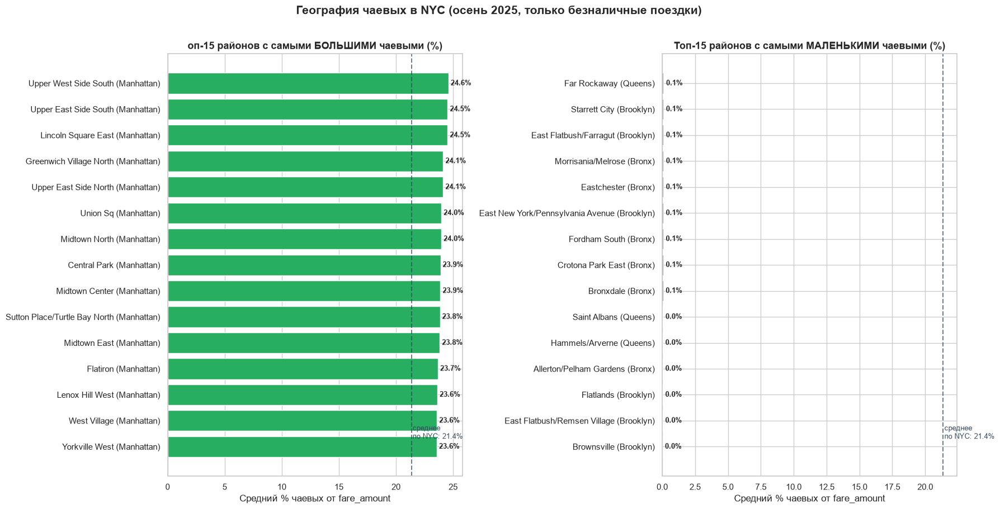
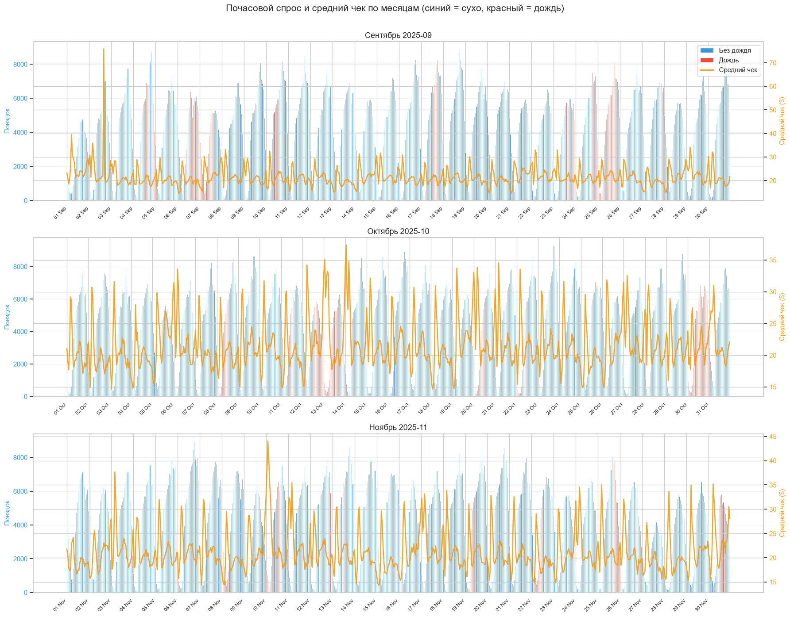
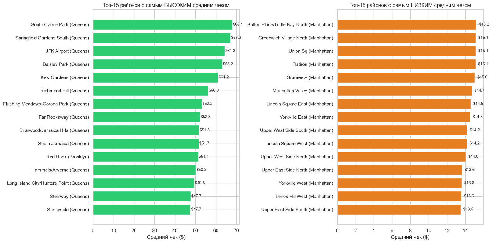

# Анализ поездок жёлтого такси в Нью-Йорке

Python, Pandas, DuckDB с HTTPFS, Plotly, Seaborn, Requests.

Исходные данные: 12 861 158 строк и 21 колонка за сентябрь-ноябрь 2025. После очистки осталось 9 225 994 строки, отсеяно 28.26%.

Источники: публичный репозиторий NYC Taxi, часовые осадки Open-Meteo, внешний CSV с зонами такси.

## Задача

Построить ETL-пайплайн на ~13 млн поездок и ответить на вопросы операционного характера: когда и где спрос, где платят больше чаевых и влияет ли погода.

## Почему DuckDB

Паркетные файлы читаются прямо из облака через HTTPFS, скачивать их целиком не нужно. `read_parquet` с удалённым источником отправляет в DuckDB только условие отбора и список колонок, поэтому из 13 миллионов строк на машину приходит существенно меньше. При таких объёмах это главный приём, тот же подход потом встречается в проектах по платежам на ClickHouse.

## Как собран пайплайн

Извлечение: три паркетных файла через HTTPFS, погода, справочник зон.

## Какие правила и сколько они режут

Правила применяются последовательно, поэтому вклад каждого считается на том, что осталось после предыдущих.

| Шаг | Отрезано | Осталось |
|---|---:|---:|
| Отсечение по датам, с 1 сентября по 30 ноября | 812 | 12 860 346 |
| `fare_amount > 0` | 975 317 | 11 885 029 |
| `trip_distance > 0` | 276 377 | 11 608 652 |
| `trip_duration_min > 0` | 183 333 | 11 425 319 |
| `trip_duration_min <= 300` | 3 777 | 11 421 542 |
| `passenger_count > 0` | 2 195 548 | 9 225 994 |

## Про порог в 300 минут

Отдельно стоит разобрать, потому что порог выглядит безобидно, а режет он мало.

Правило `trip_duration_min > 300` убирает всего 3 777 поездок из 11,4 миллиона, это 0.03%. На общую картину оно не влияет, и в исходной версии readme ему было приписано слишком много.

Что это за поездки:

| Метрика | Значение |
|---|---|
| Медиана длительности | 1392 минуты, больше суток |
| Медиана скорости | 0.10 мили в час |
| Доля поездок со скоростью меньше 8 миль в час | 99.7% |
| Максимум длительности | 8799 минут, 6 суток |

Поездка длится сутки, проходит 0.2 мили и стоит 23 доллара. Это не долгая поездка, это незакрытая смена: счётчик включился в одной точке и выключился через несколько дней, либо поездка простояла в пробке. Средняя стоимость 30.85 доллара при средней дистанции 4.57 мили это подтверждает: тариф посчитан по времени ожидания, а не по пути.

**Вывод: порог оставить, но переформулировать причину.** Он отсекает не «долгие поездки», а битые записи с незакрытым интервалом. Если бы в данных были настоящие длинные поездки, порог 300 минут их бы тоже съел, поэтому правильнее проверять не длительность, а скорость, например `trip_distance / duration > 1` миля в час. Это стоит переделать.

## Про фильтр passenger_count

Вот это правило режет больше всех, 2.2 миллиона строк, 19% выживших данных. И оно единственное, которое удаляет не мусор, а целый класс поездок.

Разбор, что именно отсекается:

| Группа | Строк | Средняя дистанция | Средний чек |
|---|---:|---:|---:|
| `passenger_count` заполнено | 9 225 994 | 3.51 мили | 20.54 |
| `passenger_count` пусто | 2 133 586 | 18.17 мили | 19.32 |
| `passenger_count = 0` | 61 962 | 2.65 мили | 17.47 |

Причина пустых значений видна сразу: у всех 2 133 586 строк `payment_type = 0`, то есть способ оплаты неизвестен. Это не битые записи, это поездки без зафиксированной оплаты. Внутри этой группы средний чек 19.32 против 20.54, то есть по выручке они похожи на остальные.

**Чем это плохо для анализа.** Отброшенные поездки в 5 раз длиннее оставленных, 18.17 против 3.51 мили. Вся аналитика по дистанции, дальности и «районам с большим чеком» систематически смещена в сторону коротких городских поездок.

Что с аэропортом: фильтр почти не трогает аэропортовые поездки. Доля `Airport_fee > 0` в оставшихся 8.87%, в отброшенных 0.11%. Вывод про 8.9% аэропортовых поездок устойчив и на фильтр не опирается.

**Что делать.** Фильтр на `passenger_count > 0` в таком виде неправильный. Он смешивает две разные вещи: ноль пассажиров это действительно ошибка, а пустое значение это отсутствие данных, и отсутствие данных не повод выкидывать строку. Минимум надо развести эти случаи, максимум отказаться от фильтра и обрабатывать `passenger_count` только там, где она нужна.

Потерянная выручка при текущем фильтре 41.2 млн долларов из 230.8 млн, 17.8%.

## Обогащение

`trip_duration_min`, `pickup_hour`, день недели, дата, флаг осадков `is_raining`, зона такси по геоцентроиду.

Загрузка: очищенный датафрейм сохраняется в `clean_taxi`, дальше агрегации и графики.

## Результаты

### Спрос по часам

Пик в 18:00, 7 499 поездок как медиана за день. Минимум в 03:00, 261 поездка. Топ-3 часа это 18:00, 17:00 и 16:00.

Средняя стоимость поездки в ранние утренние часы заметно выше: в 04:00 средний чек $26.03. Вечерний пик объясняется возвращением с работы, а дорогие ночные поездки это длинные маршруты из аэропорта и внешних бороустов.

### Средний чек по дням недели

Пик в пятницу, потом четверг. Минимум в воскресенье. Средний чек максимален в пятницу и субботу, то есть к концу недели поездки не только чаще, но и длиннее.

### Поездки в аэропорт

Максимум аэропортовых поездок приходится на 16:00-21:00. Наибольшая доля в 23:00-00:00, около 14%. В среднем 8 990 поездок в день, это 8.9% от всех.

Почти каждый десятый рейс объясняет вечерний пик. Если смотреть только на общий спрос, аэропорты не видны.

### Чаевые по районам

Щедрые районы: Upper West Side, Upper East Side, Lincoln Square, больше 24% от стоимости. Скупые: Бруклин и Бронкс, от 0 до 1%. Средний процент по городу 21.4%.

Этот срез считается только по безналичным поездкам. В наличных чаевые не попадают в выгрузку, и если смешать два типа, средний процент по городу уйдёт вниз. Разброс внутри одного города кратный, усреднение по городу для таргетинга не годится.

### Влияние погоды

В дождливые часы поездок больше на 0.1%, средний чек выше на $0.48. Эффект есть, но небольшой. В выводах это оговорено прямо, без попытки подать находку как открытие.

Дополнительно чаевые разложены по бакетам дистанции, чтобы проверить, не объясняется ли эффект тем, что в дождь едут более длинные поездки. Это контроль конфаундера, без него разница в 0.48 доллара ничего не значит.

### Средний чек по районам

Максимум у LaGuardia ($65.6), потом JFK ($59.5). Минимум в Бруклине и Бронксе, около $13-16.

Аэропорты формируют верхний хвост, и он радикально отличается от городского. Усреднение по NYC аккуратно затирает оба режима.

**Оговорка к этому срезу.** Районы считаются по чистым данным, то есть без 19% поездок с неизвестной оплатой и длинного расстояния. Карта «кто больше платит» построена по коротким городским поездкам и может искажать реальную картину на окраинах.
