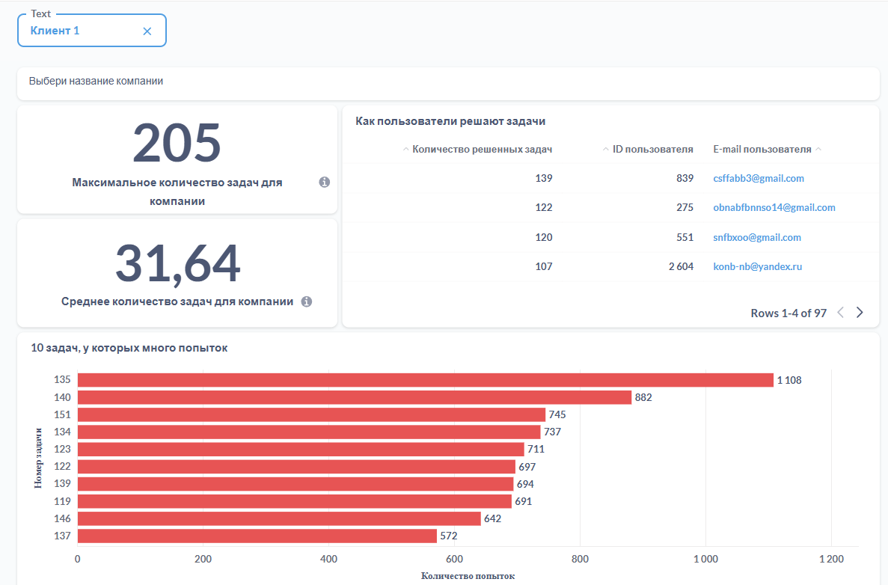
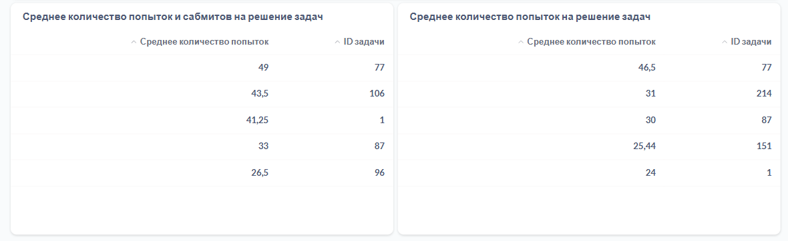

# Динамические дашборды в Metabase

Metabase поверх PostgreSQL. Данные платформы IT Resume: пользователи, компании, отправки и запуски решений.

## Задача

Собрать дашборд с фильтрами, который отвечает на операционные вопросы по прогрессу студентов и даёт менять компанию прямо на дашборде.

## Вопросы на дашборде

Все запросы в `question.sql`. Фильтр компании задаётся нативной параметризацией Metabase через `{{company_name}}`, поэтому дашборд работает на любой компании без копий запросов.

| Панель | Как считается |
|--------|---------------|
| Максимум задач у компании | `COUNT(DISTINCT codesubmit.problem_id)` через `codesubmit` → `users` → `company` |
| Среднее количество задач | CTE считает число уникальных задач на студента, поверх `AVG` |
| Как решают задачи | Разбивка по студентам с `user_id` и почтой |
| 10 задач с наибольшим числом попыток | `UNION ALL` из `coderun` и `codesubmit`, группировка по паре студент и задача, суммирование, `LIMIT 10` |
| Среднее попыток и сабмитов | Считается раздельно по двум таблицам |
| Среднее попыток | Объединённый поток обеих таблиц |

## Пара деталей

`COUNT(DISTINCT ...)` вместо `COUNT(*)`. Иначе задача, отправленная пять раз, посчитается как пять разных.

Средние всегда считаются в два прохода через CTE. Метрика сначала сворачивается до уровня студента или задачи, и только потом усредняется.

`UNION ALL` вместо раздельных запросов. Попытка может быть и запуском, и отправкой, и обе нужны для оценки сложности.

## Отдельно про то, зачем нужны фильтры

Дашборд без фильтра это картинка. Фильтр по компании превращает набор из восьми графиков в инструмент: тот же запрос обслуживает и одного клиента, и всю базу клиентов. Копия запроса на каждого клиента обслуживалась бы, но перестала бы работать у первого же нового клиента.
