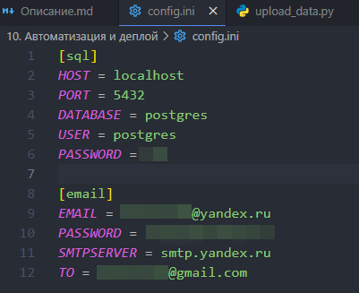
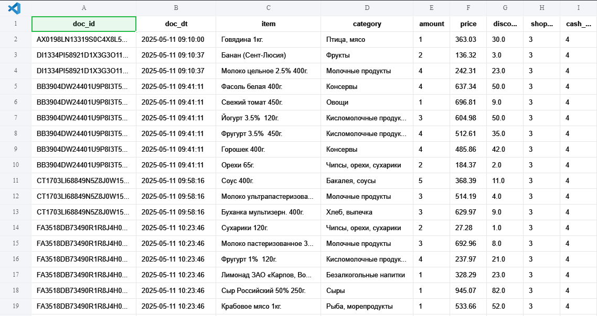

# Пайплайн обработки чеков

Python, PostgreSQL, `psycopg2`, `random`, `numpy`, `faker`, cron или Планировщик задач.

ТЗ в [Описание.md](Описание.md).

## Задача

Смоделировать работу кассовой программы сети и построить ежедневную загрузку чеков в базу. Генерация выгрузок и загрузка запускаются по расписанию, без участия человека.

## Файлы проекта

```
generate_data.py   эмуляция кассовой программы
pgdb.py            класс PGDatabase, единственный метод post
upload_data.py     загрузка файлов из data/
requirements.txt
data/              сгенерированные выгрузки
img/               скриншоты автоматизации и таблиц
sql/               DDL: stores.sql, ticket.sql
logs/              логи по датам
```

## Эмуляция кассовой программы

`generate_data.py` имитирует выгрузку чеков из N кассовых аппаратов в папку `data/`. Имена файлов `{shop_num}_{cash_num}.csv`, например `11_2.csv` это магазин 11, касса 2. В одном магазине касс несколько, у каждой своя выгрузка.

Поля выгрузки: `doc_id` идентификатор чека, `doc_dt` дата и время, `item` товар, `category` категория, `amount` количество, `price` цена без скидки, `discount` сумма скидки, может быть ноль.

Данные генерируются на `random`, `numpy` и `faker`. Запуск по расписанию ежедневно, кроме воскресенья.

## Загрузка

Класс `PGDatabase` в файле `pgdb.py`. В нём одна функция `post`: задача требует только записи, остальные методы не нужны и не написаны.



Файлы `.csv` забираются из `data/`, остальные форматы игнорируются. Перед записью проверяется схема, то есть наличие нужных столбцов.

Проверка обязательна. Файл с изменившимися заголовками должен отклоняться с записью в лог, а не падать где-то посреди загрузки. Второй вариант хуже: он оставляет таблицу в неизвестном состоянии, и заметить это можно только через месяц.



Логи пишутся в `logs/{today}.log`.

## Схема базы

Схема вынесена в отдельные SQL-файлы: `stores.sql` со справочником магазинов и `ticket.sql` с чеками. Так её можно применить повторно без Python и проверить отдельно от логики загрузки.

## Про подключение к БД

`pgdb.py` поднимает соединение под каждую операцию, судя по скриншотам. Для ежедневной загрузки это лишние рукопожатия с сервером, и при росте числа файлов станет заметно. Класс из проекта с выгрузкой из API уже сделан через синглтон, логику можно переиспользовать.
