# Три торговые сети: EDA и дашборд

Python, Pandas, Plotly, Folium, Power BI. Данные чеков трёх федеральных сетей: Окей (20 магазинов), Гиперглобус (7), Метро c&c (8).

Проект из двух частей на одном наборе данных. Сначала исследование в Python, потом те же выводы перенесены в интерактивный дашборд Power BI.

## Файлы

- `analyse.ipynb`. Расчёты в Python.
- `requirements.txt`. Зависимости.
- `ТЗ.xlsx`. Исходное задание.
- `Дашборд Power BI.pbix`. Файл дашборда.
- `ABC-XYZ.rar`, `ABC-XYZ.pcl.gz`. Результаты ABC-XYZ по сетям.
- `RFM {сеть}.csv`. Результаты RFM.
- `Список магазинов.csv`. Справочник точек.
- `pics/`. Графики из ноутбука.
- `pics_dashboard/`. Скриншоты страниц дашборда.

## Часть 1. Исследование

### Инвентаризация

Проверено, какие сети есть в массиве и сколько в них точек. Построена интерактивная карта расположения магазинов.

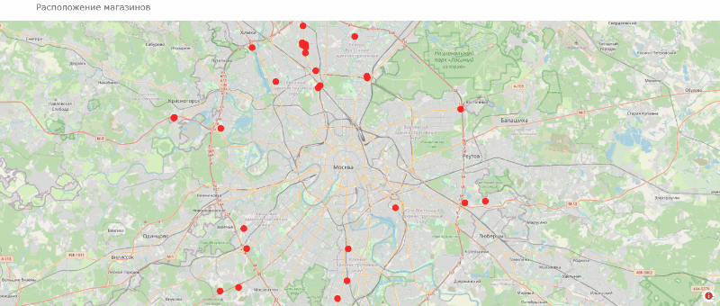

### Качество данных

Boxplot по каждой сети до и после очистки, видно какие выбросы и за что отсеяны. Без этого средний чек и прибыль считаются по артефактам выгрузки, и выводы потом разъезжаются.

До очистки:

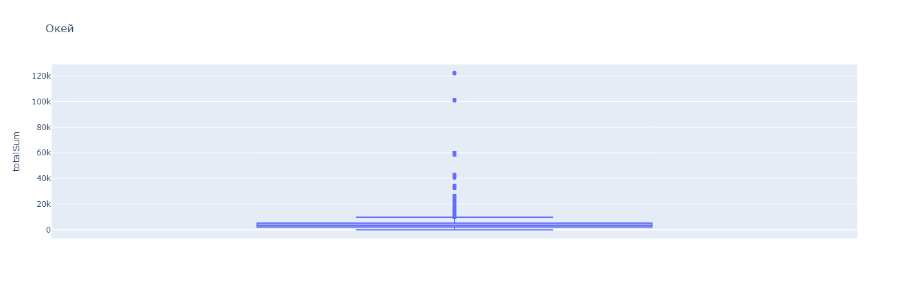
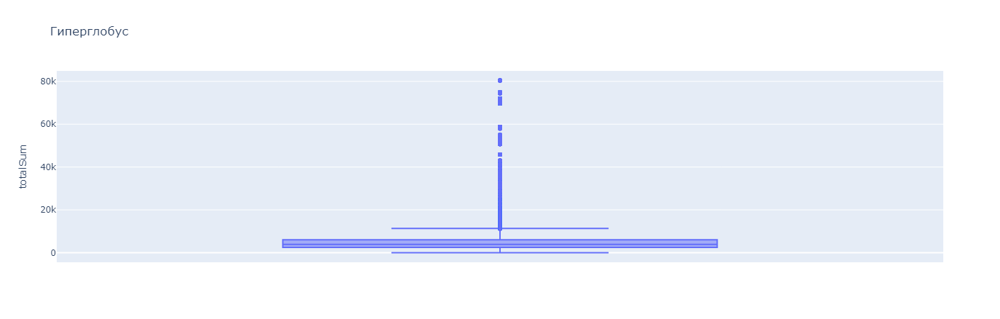
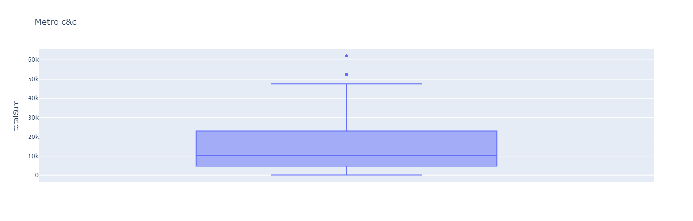

После очистки:

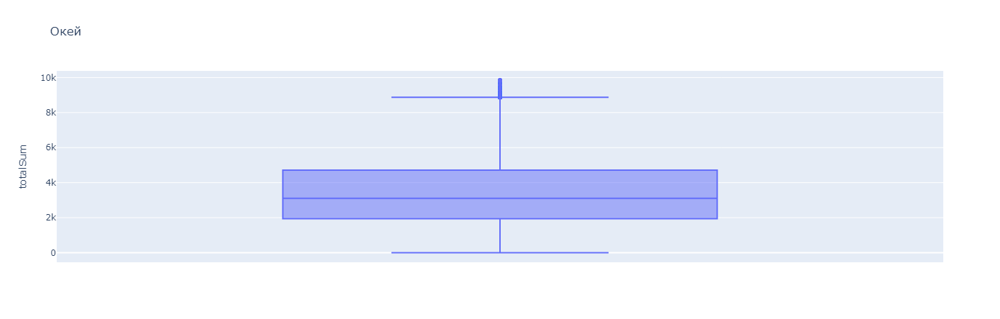
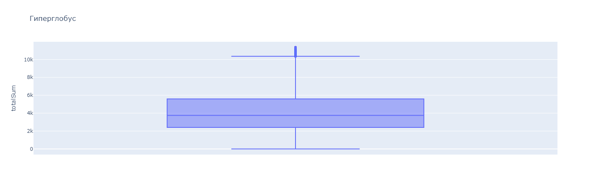
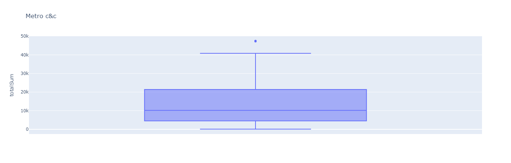

### Корреляции

Корреляционная матрица по показателям сетей. Проверка на мультиколлинеарность перед построением витрины и выбором фичей для дашборда.

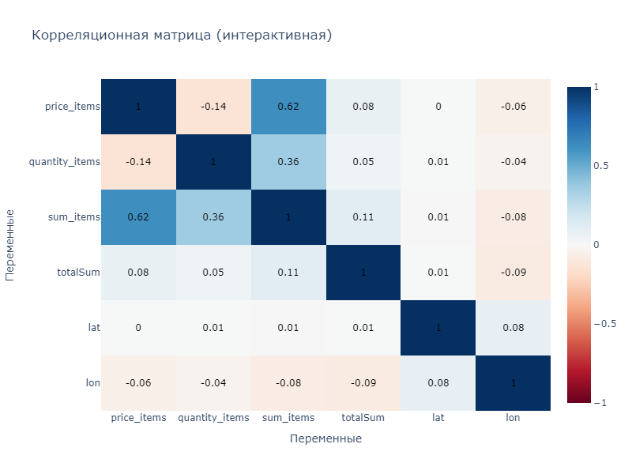

### Ассортимент

- ABC по `CLEAN_SKU` по прибыли
- ABC по `CLEAN_SKU` по количеству позиций
- ABC по `CATEGORY_NT` по количеству позиций
- XYZ по `CLEAN_SKU`

Результаты в файлах `ABC-XYZ {название сети}`. Логика методов вынесена в функции, поэтому применяются к любому отдельному магазину, достаточно отфильтровать датафрейм.

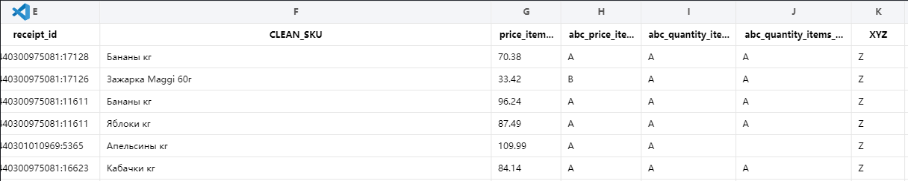

### Средняя цена по категориям

Посчитана в двух версиях. Первая берёт все значения вместе с пропусками, и по ней видно, каких категорий в сети нет вообще. Вторая оставляет только категории, присутствующие во всех трёх сетях.

Без разделения этих двух разрезов сравнение некорректно: разница в средней цене тогда объясняется разным ассортиментом, а не разными ценами.

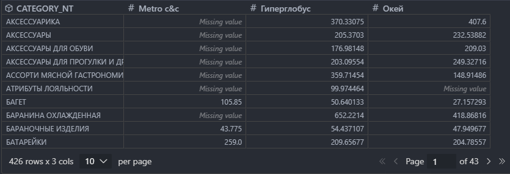
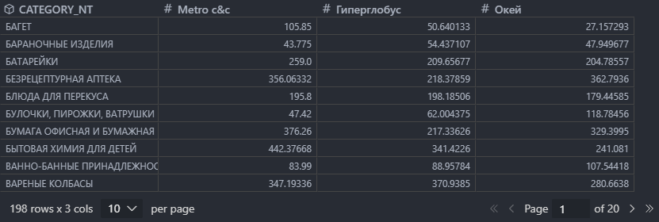

### Средний чек

Посчитан по часам и дням недели для сравнения сетей между собой, отдельно по часам и дням недели внутри каждого магазина. Первые два разреза закрыты интерактивными графиками.

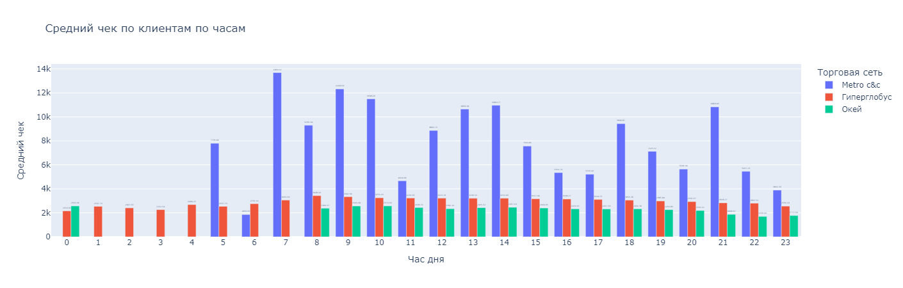
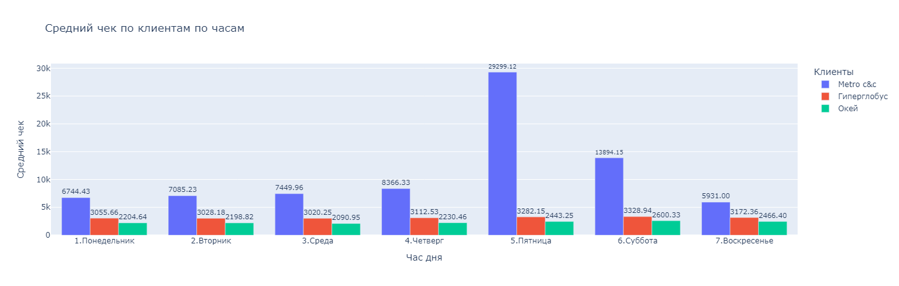

### RFM

Сделан по клиентам, у которых определён `customer_id`, то есть там, где работает карта магазина. Результаты в файлах `RFM {название сети}`.

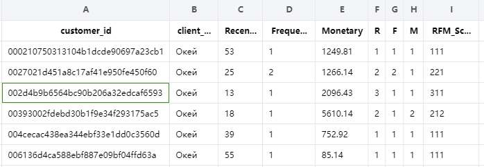

## Выводы

ABC:

- **A** даёт около 80% выручки на 20% позиций. Держится на складе всегда, дефицит сразу роняет выручку.
- **B** кандидуты в A. Выручки дают мало, но держать надо, иначе могут туда перейти.
- **C** выручки почти не дают, закупать реже, часть позиций можно вывести.

XYZ:

- **X** стабильный спрос, всегда в наличии.
- **Y** спрос средний, скорее всего сезонный. Закупать крупно смысла нет.
- **Z** спрос редкий. Сначала смотреть поставки: если товара и так хватало, его можно закрыть или перевести под предзаказ.

RFM, где R это дни с последней покупки, F частота, M прибыль, везде 1 это мало, 3 это много:

- **133 и 233** много приносят, но редко покупают. Основа для персональных предложений.
- **313 и 323** недавно покупали, но прибыли мало. Подойдут рассылки про акции на их категории.
- **222** середняки по всем осям. Цель вывести в 322, 232 или 223, средства те же.

## Часть 2. Дашборд Power BI

Те же данные, перенесённые в интерактивный инструмент.

### Обзор

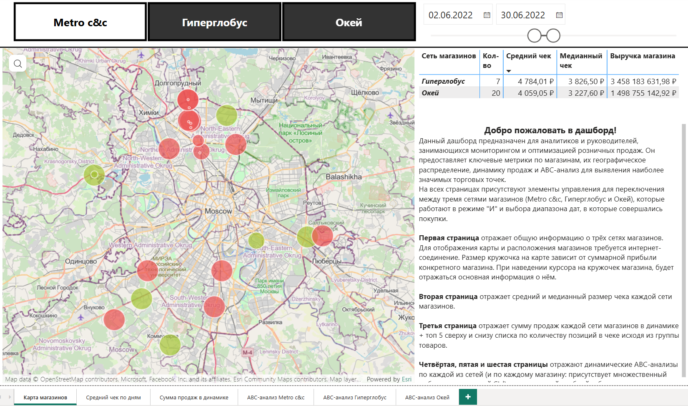

Интерактивная карта с расположением магазинов, для неё нужен интернет. Размер кружка кодирует суммарную прибыль конкретного магазина, то есть карта работает сразу и как география, и как ранг магазинов. При наведении показывается основная информация по точке.

### Размер чека по сетям

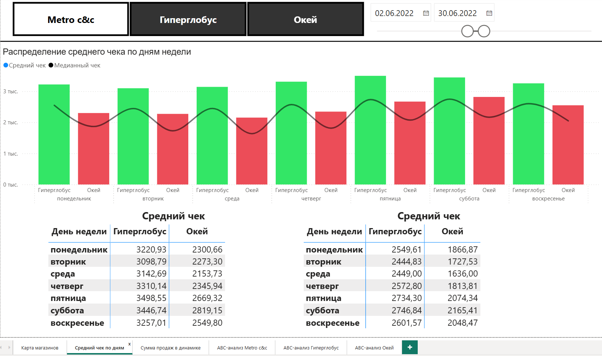

Средний и медианный чек каждой сети. Медиана не для украшения: у чеков длинный хвост, среднее завышено, и без медианы сравнение сетей выглядит убедительнее, чем на самом деле.

### Динамика продаж и структура чека

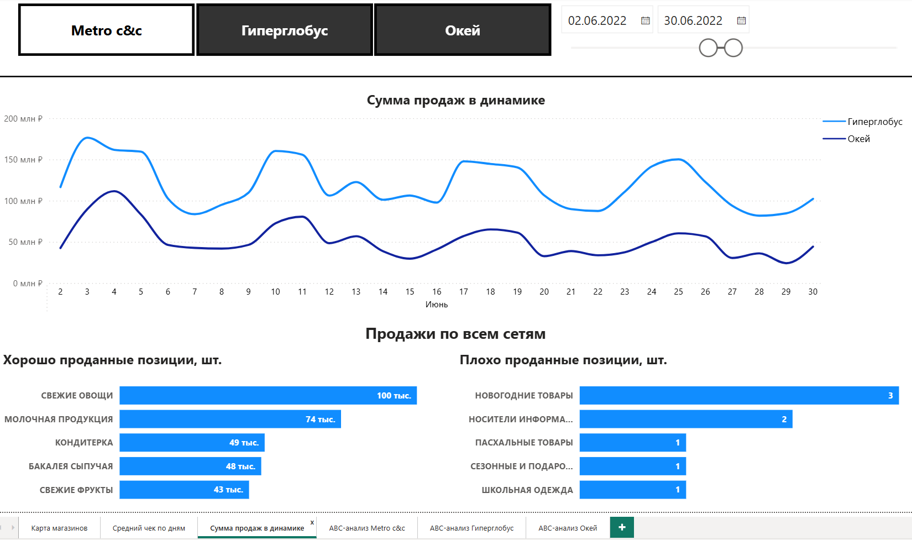

Сумма продаж каждой сети в динамике и топ-5 групп товаров сверху и снизу списка по количеству позиций в чеке.

Верх и низ показываются вместе. Лидеры и аутсайдеры ассортимента это два разных управленческих сигнала, и по отдельности ни один из них не читается.

### Три страницы динамического ABC

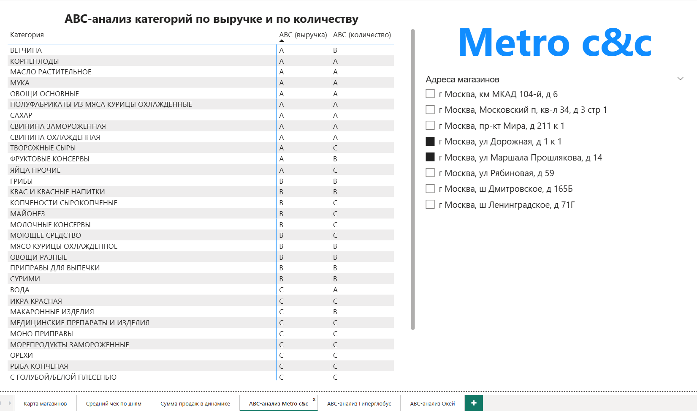
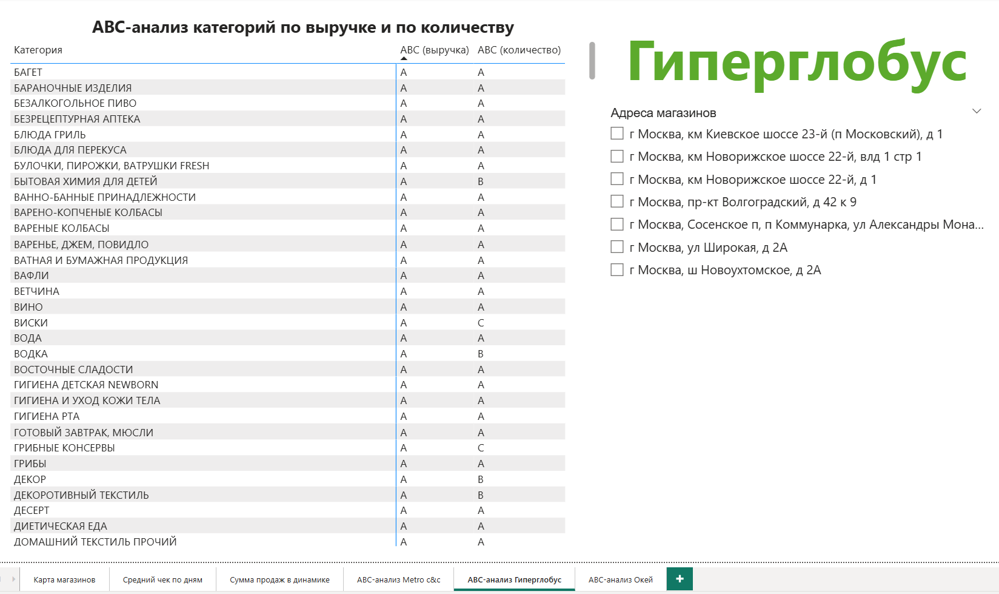
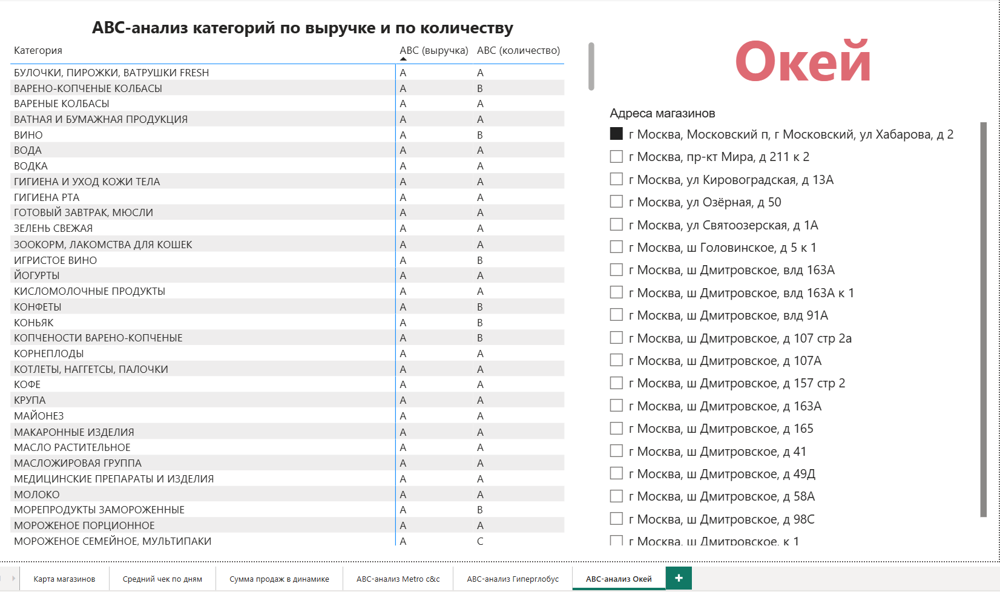

По странице на сеть, ABC доступен по любому магазину с множественным выбором через Ctrl. Результат показан таблицей: это рабочий список позиций для категорийного менеджера, ему нужен перечень, а не картинка.

## Зачем две части

Исследование отвечает на вопрос «что происходит», дашборд на вопрос «что происходит прямо сейчас». Разделение не из эстетики: в ноутбуке видно логику расчёта и можно проверить каждое число, в дашборде видно только результат и доступны фильтры.

И ещё одна причина. Часть выводов из ноутбука, особенно RFM-сегменты по конкретным сочетаниям осей, в дашборд не переносилась: держать в готовом инструменте список из трёх тысяч строк ради ручного разбора никто не будет. Дашборд оставлен под то, что действительно смотрят регулярно.

## Про файл pbix

Файл содержит локальный кэш данных, поэтому весит заметно. Перед тем как отдавать репозиторий, стоит проверить, не остались ли внутри сырые чеки с необезличенными данными. Для регулярной работы правильнее параметризованный pbix без данных либо пагинированный отчёт, который тянет данные из источника.
